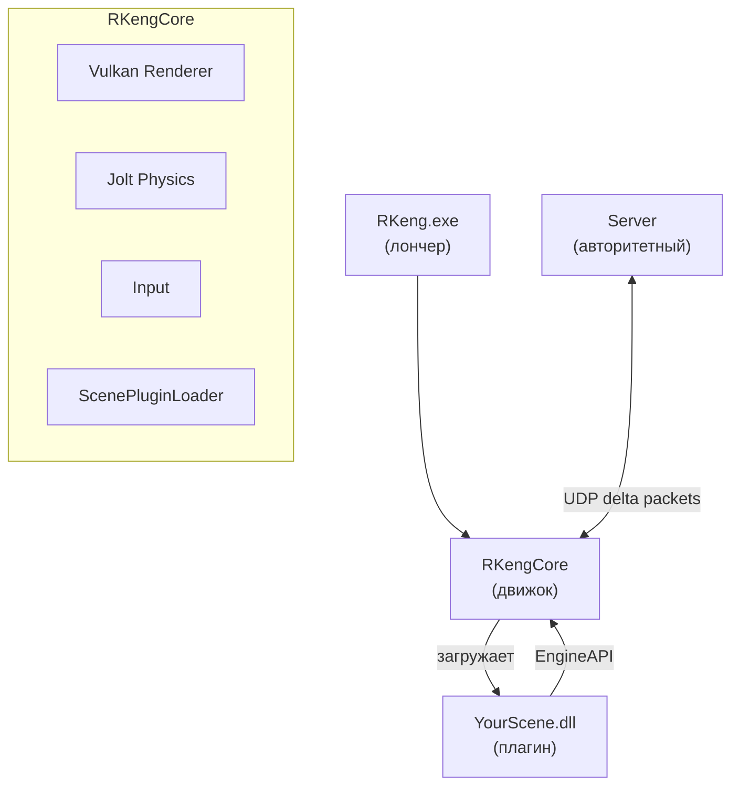

<div align="center">

# RKeng

[](https://en.cppreference.com/w/cpp/20)
[](https://www.vulkan.org/)
[](https://github.com/jrouwe/JoltPhysics)
[](/)
[](/)
[](/)

**Игровой движок на C++ с нуля. Никаких абстракций ради абстракций.**

</div>

---

## Почему не Unity / Unreal / Godot

| | RKeng | Unity | Unreal | Godot |
|---|---|---|---|---|
| Размер рантайма | ~1MB | ~200MB | ~500MB+ | ~40MB |
| Vulkan от метала | ✅ | ❌ абстракция | ❌ абстракция | ❌ абстракция |
| Delta compression из коробки | ✅ | ❌ | платно (Netcode) | ❌ |
| DLL-плагины без рестарта движка | ✅ | ❌ | ❌ | ❌ |
| Полный контроль над физическим тиком | ✅ | ❌ | частично | ❌ |
| Кастомный сетевой протокол | ✅ | ❌ | ❌ | ❌ |
| Royalty / подписка | нет | есть | 5% revenue | нет |

---

## Архитектура



---

## Возможности

<details>
<summary>🎨 Рендер</summary>

Низкоуровневый Vulkan — без абстракций поверх API.  
Instanced rendering, frustum culling, разрушаемая воксельная геометрия.  
Каждый этап инициализации в отдельном файле — ничего не теряется в 2000-строчном монолите.

</details>

<details>
<summary>⚙️ Физика</summary>

Jolt Physics собирается из исходников.  
Персонажи, транспорт, разрушаемые объекты, произвольные тела — всё доступно через `EngineAPI` из плагина.

</details>

<details>
<summary>🌐 Сеть</summary>

Авторитетный сервер на кастомном бинарном протоколе поверх raw UDP.  
Delta compression — только изменившиеся поля, только нужные байты.

</details>

<details>
<summary>🔌 Плагины</summary>

Игровые сцены — отдельные DLL.  
Движок собирается один раз. Сцены грузятся, выгружаются и обновляются без рестарта.  
Jolt синглтоны общие — никакой двойной инициализации.

</details>

---

## Роадмап

<details>
<summary>Показать</summary>

```
✅ AntiLAGv1        — delta compression сетевых пакетов
🔄 SeamlessHandoff  — бесшовные переходы между серверами
🔄 DirectToGPU      — физика и куллинг в Vulkan compute
🔄 TransportRPhysics — физика транспорта из произвольной геометрии
💡 AutoContentGen   — генерация ассетов из текстового промпта
💡 RKlang           — скриптовый язык, читерство запрещено компилятором
✅ AIShutUpper      — агент кодогенерации на локальном LLM
```

</details>

---

## Разработка сцены

<details>
<summary>Показать</summary>

Скопируй `sdk/`, реализуй `IScenePlugin`, экспортируй фабрику:

```cpp
class MyScene : public RKeng::IScenePlugin {
public:
    const char* GetName() const override { return "my_scene"; }
    void OnLoad(RKeng::SceneState&, RKeng::PhysicsState&, const RKeng::EngineAPI&) override;
    void OnTick(RKeng::SceneState&, RKeng::PhysicsState&, float dt) override;
};

extern "C" {
    RK_EXPORT RKeng::IScenePlugin* RK_CreateScene()                { return new MyScene(); }
    RK_EXPORT void                 RK_DestroyScene(IScenePlugin* p) { delete p; }
}
```

</details>

---

## Сборка

<details>
<summary>Показать</summary>

**Требования:** CMake 3.20+, C++20, Vulkan SDK

```bash
git clone https://github.com/satorudio/RKeng.git
cd RKeng/RKeng && mkdir build && cd build
cmake -G "Unix Makefiles" .. && ninja
```

</details>

---

## Лицензия

Проприетарный. Использование и распространение без разрешения запрещено.
